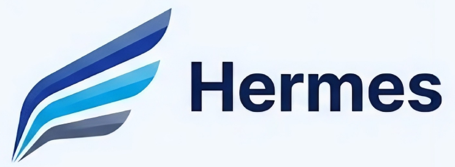

<div align="center">

<!-- PORTADA: sustituir por imagen del banner de Hermes -->
<!-- Recomendación: imagen de 1280x640px con fondo claro, logo centrado y tagline -->


# HERMES

**Detección de phishing multi-agente especializada en España**

*Jose Miguel Martínez · jmiguel16@hotmail.es*

---

<!-- BADGES: actualizar cuando el proyecto tenga CI/CD -->


</div>

---

## El problema que resuelve

España es uno de los países europeos con mayor incidencia de phishing y smishing. El INCIBE-CERT gestiona decenas de miles de incidentes anuales, y la mayoría de las víctimas son ciudadanos que reciben un SMS haciéndose pasar por Correos, BBVA o Hacienda.

Las soluciones de detección existentes en el mercado están construidas para el entorno anglosajón. Detectan dominios maliciosos conocidos, pero fallan sistemáticamente ante campañas nuevas en castellano que imitan marcas españolas. El atacante lo sabe, y lo explota.

Hermes nació para cubrir ese hueco concreto.

---

## Qué es Hermes

Hermes es un sistema de análisis de amenazas digitales especializado en el ecosistema de ciberseguridad español. Detecta phishing, smishing y fraude por URL en tiempo real a través de una arquitectura de inteligencia artificial propia compuesta por seis agentes especializados que trabajan en paralelo.

El sistema analiza tres vectores de ataque: SMS y WhatsApp, correo electrónico completo con cabeceras técnicas, y URLs sospechosas. Cada análisis atraviesa el pipeline completo y devuelve un veredicto con porcentaje de confianza, identificación de la marca suplantada, tipo de ataque detectado e indicadores de compromiso extraídos.

<!-- SCREENSHOT: captura del analizador con un caso de PHISHING activo -->
<!--  -->

---

## Arquitectura: seis agentes de IA

El pipeline de análisis sigue una secuencia diseñada para maximizar precisión minimizando latencia.

```
Entrada → BERT Pre-filtro → [Agentes paralelos] → Moderador → Juez Final → Veredicto
                                    │
                    ┌───────────────┼───────────────┐
                    │               │               │
             URL Analyzer   Content Analyzer   Brand Agent
                                    │
                             Header Analyzer
```

**BERT Pre-filtro** actúa primero. Para el 80% de los casos donde la señal es inequívoca, devuelve veredicto en menos de 50ms sin activar el resto del pipeline. Solo los casos ambiguos continúan.

**URL Analyzer** examina estructura del dominio, edad del registro, typosquatting y redirecciones encadenadas.

**Content Analyzer** analiza patrones lingüísticos de ingeniería social en castellano: urgencia artificial, suplantación de tono corporativo, solicitudes de credenciales.

**Brand Agent** compara el mensaje contra los patrones de comunicación legítimos de 17 marcas españolas. Es el agente más diferencial de Hermes respecto a cualquier solución genérica.

**Header Analyzer** verifica autenticación técnica del correo electrónico: SPF, DKIM y DMARC.

**Juez Final** sintetiza los veredictos individuales, pondera conflictos entre agentes e incorpora contexto de alertas activas de INCIBE y CCN-CERT mediante un sistema RAG propio.

---

## Marcas cubiertas

17 marcas españolas en base de conocimiento activo, seleccionadas por frecuencia de suplantación documentada en alertas oficiales.

Sector bancario: BBVA, CaixaBank, Santander, Sabadell, ING, Bankinter.
Administración pública: AEAT/Hacienda, Seguridad Social, Correos, DGT, Sede Electrónica del Estado.
Telecomunicaciones: Movistar, Vodafone, Orange.
Utilities: Endesa, Iberdrola.
Retail: Amazon España.

---

## Rendimiento

Benchmarks obtenidos sobre dataset de evaluación propio compuesto por casos reales de campañas activas en España durante 2024-2025.

### Hermes vs sistemas de detección tradicionales

<br>

**Accuracy**

| Sistema | Resultado |
|---|---|
| Hermes | `████████████████████████████████████████ 88%` |
| Filtros basados en listas negras | `██████████████████████ 48%` |
| Modelos genéricos (inglés) | `████████████████████████████ 61%` |
| Heurísticas de URL | `███████████████████████████ 59%` |

<br>

**Recall — capacidad de no dejar pasar un ataque real**

| Sistema | Resultado |
|---|---|
| Hermes | `████████████████████████████████████████████ 100%` |
| Filtros basados en listas negras | `████████████████ 35%` |
| Modelos genéricos (inglés) | `██████████████████████████ 57%` |
| Heurísticas de URL | `████████████████████ 44%` |

<br>

**Latencia media (modo caliente)**

| Sistema | Resultado |
|---|---|
| Hermes · casos directos (BERT) | `██ ~50ms` |
| Hermes · análisis completo | `████ ~160ms` |
| APIs externas de análisis | `████████████████████ ~800ms` |
| Sandboxes cloud | `████████████████████████████████████████ ~4000ms` |

<br>

El recall del 100% es una decisión de diseño deliberada. En detección de amenazas, un falso negativo —dejar pasar un ataque real— tiene un coste humano y económico que supera siempre al de un falso positivo.

<!-- SCREENSHOT: captura del pipeline con agentes en diferentes estados -->
<!--  -->

---

## Stack tecnológico

Hermes está construido sobre infraestructura completamente local y open source. El componente central de inferencia es **Ollama**, que permite ejecutar el modelo de lenguaje Qwen2.5 en la propia infraestructura del operador sin depender de ninguna API externa de IA.

Esta elección no es casual. Tiene tres consecuencias directas: ningún mensaje analizado sale del servidor, la latencia no depende de terceros, y el cumplimiento del RGPD es estructural, no una capa añadida.

El pipeline de agentes está construido con LangGraph. El backend expone una API REST desarrollada en FastAPI. La base de conocimiento histórico se almacena en PostgreSQL con soporte de embeddings para el sistema RAG. El frontend es HTML/CSS/JS puro, sin frameworks, desplegable en cualquier servidor estático.

```
LangGraph (pipeline)     →  Orchestración de agentes
Ollama + Qwen2.5:7b      →  Inferencia local
FastAPI                  →  API REST
PostgreSQL               →  Persistencia + RAG histórico
INCIBE / CCN-CERT feeds  →  Contexto de amenazas activas
```

---

## Privacidad por diseño

Ningún dato analizado sale de la infraestructura del operador. No hay llamadas a APIs externas de análisis, no hay telemetría, no hay almacenamiento en servicios de terceros. El sistema funciona completamente en modo on-premise.

Esta arquitectura hace que el cumplimiento del RGPD sea consecuencia del diseño, no un requisito a gestionar a posteriori.

---

## Estado del proyecto

Hermes está actualmente en fase beta privada. El acceso público al analizador web y la API pública están en desarrollo.

- Motor multi-agente operativo
- BERT pre-filtro con 99.6% de reducción de latencia en casos directos
- RAG con alertas INCIBE y CCN-CERT integrado
- Frontend web funcional
- API pública — próximamente
- Integración VirusTotal — próximamente

<!-- SCREENSHOT: captura de la pestaña de información del proyecto -->
<!--  -->

---

## Contacto

Este proyecto es de desarrollo propio y no está disponible para uso público sin autorización expresa.

Para consultas sobre acceso, colaboraciones, integraciones o uso comercial:

**Jose Miguel Martínez**
jmiguel16@hotmail.es

---

## Licencia

Copyright © 2025 Jose Miguel Martínez. Todos los derechos reservados.

Este software está protegido bajo licencia propietaria. Consulta el archivo [LICENSE](LICENSE) para los términos completos.

El uso, distribución, modificación o referencia pública a este software sin autorización escrita del autor está expresamente prohibido.
